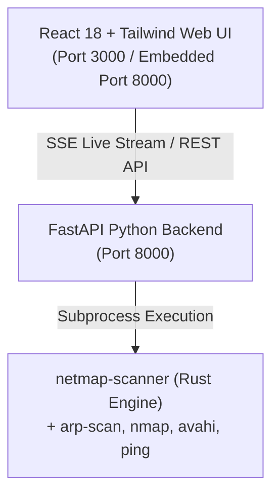

# 🌐 NetMap — High-Performance Network Reconnaissance & Topology Visualizer

[](LICENSE)
[](scanner/)
[](backend/)
[](frontend/)
[](Dockerfile)

**NetMap** is an advanced, ultra-fast network discovery suite and interactive topology visualizer built for cybersecurity professionals, VAPT engineers, and system administrators. Powered by a multi-threaded Rust scanning engine, FastAPI backend, and an obsidian-themed React visualizer, NetMap performs active L2/L3 host sweeps, deep service banner grabbing, mDNS/NetBIOS/SSL/TTL fingerprinting, and live SSE topology streaming.

---

## ⚡ Key Features

- **🚀 Multi-Threaded Rust Scanner Engine (`netmap-scanner`)**: Sub-second subnet sweeps powered by async Rust (`tokio`).
- **🔍 Deep Device Fingerprinting**: Combines ICMP TTL heuristics, HTTP title extraction, SSL CN parsing, mDNS (`avahi-resolve`), and NetBIOS (`nmblookup`).
- **📡 Real-Time SSE Streaming**: Live discovery feed line-by-line via Server-Sent Events (NDJSON to frontend).
- **🐋 Docker-Native**: Single-command container deployment with host networking.

---

## 🏗️ Architecture Overview



---

## 🔒 Permission & Security Setup (Compulsory for Full Capabilities)

For NetMap to achieve **100% host discovery, accurate OS fingerprinting, and raw packet control** (ICMP ping sweeps, ARP scans, SYN probes, and TTL calculations), elevated network permissions are required.

> [!IMPORTANT]
> **Security Best Practice:** Never run the FastAPI web server or Python process as `root`. NetMap uses **Linux File Capabilities** (`setcap`), granting raw socket permissions **only** to the compiled scanner binary while keeping the web application safely unprivileged.

### 🐧 Linux Privilege Setup (Recommended)

After compiling the Rust binary, run the privilege setup script once:

```bash
cd scanner
./setup-privileges.sh
```

Or execute manually:

```bash
# Grant RAW network capabilities to the scanner binary and helper utilities
sudo setcap cap_net_raw,cap_net_admin+eip scanner/target/release/netmap-scanner
sudo setcap cap_net_raw,cap_net_admin+eip $(which arp-scan)
sudo setcap cap_net_raw+eip $(which nmap)
```

Verify capability assignment:
```bash
getcap scanner/target/release/netmap-scanner
```

---

### 🪟 Windows Privilege Setup

1. **Install Npcap / WinPcap Driver**: Download and install [Npcap](https://npcap.com/#download) with *"Support raw 802.11 traffic"* enabled.
2. **Run in Administrator Terminal**: Launch PowerShell or Command Prompt as **Administrator** when executing the scanner binary or docker container.

---

### 🍎 macOS Privilege Setup

1. **Grant BPF Device Access**: macOS requires permissions on Berkeley Packet Filter (`/dev/bpf*`) devices:
   ```bash
   sudo chown $USER:admin /dev/bpf*
   ```
2. Alternatively, run the scanner component with `sudo`:
   ```bash
   sudo ./scanner/target/release/netmap-scanner --subnet auto
   ```

---

## 🚀 Installation & Setup Guide

### 🐳 Option 1: Docker (Fastest & Easiest)

Docker allows instant deployment with pre-configured Linux capabilities and host network access.

#### Using Docker Compose (Recommended)

```bash
# 1. Clone repository
git clone https://github.com/captrit/netmap.git
cd netmap

# 2. Build and start container
docker compose up --build
```

Access the Web Dashboard at: **`http://localhost:8000`**

#### Using Docker Run

```bash
docker build -t netmap .

docker run -d \
  --name netmap \
  --net=host \
  --cap-add=NET_RAW \
  --cap-add=NET_ADMIN \
  netmap
```

---

### 🐧 Option 2: Linux Native Setup

#### Prerequisites
- **Rust**: `curl --proto '=https' --tlsv1.2 -sSf https://sh.rustup.rs | sh`
- **Python**: `python3` (v3.10+) and `pip`
- **Node.js**: `node` (v18+) and `npm`
- **Network utilities**: `sudo apt install nmap arp-scan avahi-utils iputils-ping`

#### Build & Run Step-by-Step

```bash
# 1. Clone repository
git clone https://github.com/captrit/netmap.git
cd netmap

# 2. Build Rust Scanner Engine
cd scanner
cargo build --release
cd ..

# 3. Apply raw socket permissions
./scanner/setup-privileges.sh

# 4. Set up Python environment & install dependencies
python3 -m venv venv
source venv/bin/activate
pip install -r requirements.txt

# 5. Install Frontend dependencies
cd frontend
npm install
cd ..

# 6. Start NetMap using unified launcher
./start_netmap.sh
```

Access Web UI at: **`http://localhost:3000`** (Backend API running on `http://localhost:8000`).

---

### 🪟 Option 3: Windows Setup (via WSL2 or Native)

#### Option A: Using WSL2 (Ubuntu on Windows) — Recommended
1. Install WSL2: `wsl --install`
2. Open Ubuntu terminal inside WSL2 and follow the **Linux Native Setup** above.

#### Option B: Windows Native Setup
1. Install [Rust for Windows](https://www.rust-lang.org/tools/install).
2. Install [Python 3](https://www.python.org/downloads/) & [Node.js](https://nodejs.org/).
3. Install [Npcap](https://npcap.com/).
4. In an **Administrator PowerShell**:
   ```powershell
   cd scanner; cargo build --release; cd ..
   pip install -r requirements.txt
   cd frontend; npm install; cd ..
   python backend\main.py
   ```

---

### 🍎 Option 4: macOS Setup

```bash
# 1. Install prerequisites via Homebrew
brew install rust node python3 nmap arp-scan

# 2. Clone and build scanner
git clone https://github.com/captrit/netmap.git
cd netmap/scanner
cargo build --release
cd ..

# 3. Grant BPF socket permissions
sudo chown $USER:admin /dev/bpf*

# 4. Install backend & frontend dependencies
python3 -m venv venv
source venv/bin/activate
pip install -r requirements.txt
cd frontend && npm install && cd ..

# 5. Launch NetMap
./start_netmap.sh
```

---

## 📡 API Reference

| Endpoint | Method | Description |
|---|---|---|
| `/api/health` | `GET` | Health check & engine status |
| `/api/interfaces` | `GET` | List host network interfaces & IP subnets |
| `/api/topology` | `GET` | Fetch latest cached network topology |
| `/api/scan` | `POST` | Trigger synchronous full-subnet scan |
| `/api/scan/stream` | `GET` | SSE stream for real-time live host discovery |
| `/api/history` | `GET` | List session scan history |
| `/api/history` | `DELETE` | Clear session history |

---

## 📄 License

Distributed under the **MIT License**. See [`LICENSE`](LICENSE) for more details.
